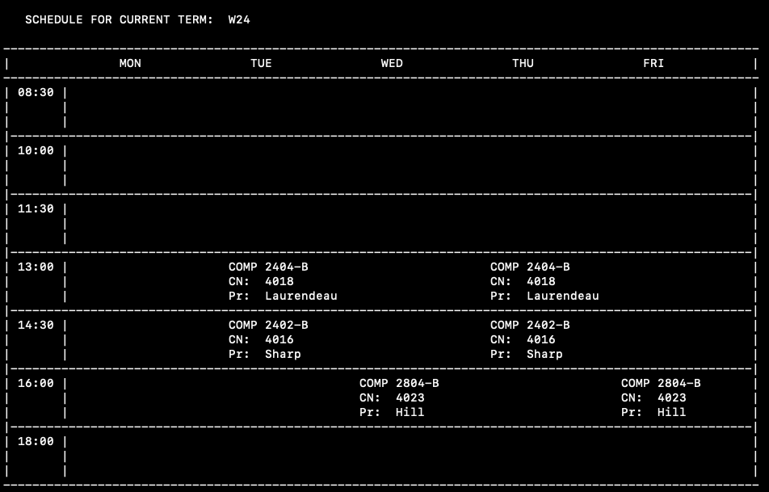
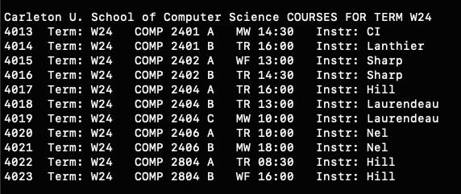

# COMP2404 - Assignment 2 
#### Working with pointers, and dynamic memory allocation
 Creating and Displaying the end user's weekly course schedule for different academic terms. 
 The program will allow the user to change the selected term, view the available courses for the selected term,
 View the user's weekly schedule for that term, add a course to the user's schedule, or clear their schedule.

## Sample Schedule Output 


## Sample Courses Output


## Usage
this program uses Makefiles for compilation and linking.

to compile the program, navigate to the folder the program resides and run...
```sh
make
```

to run the program, run...
```sh
./assignment02
```

to clean object files afterwards, run...
```sh
make clean
```


